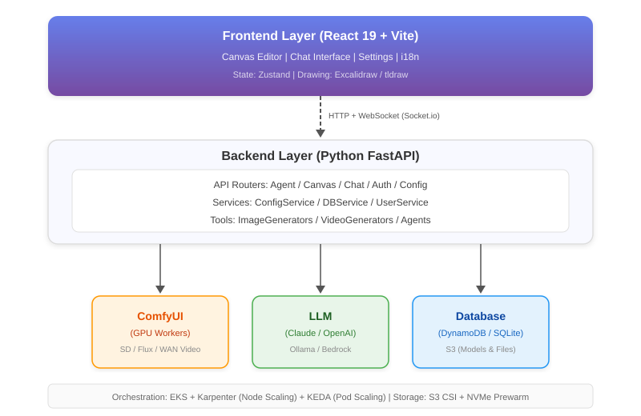

# 构建云原生 AI 图像&视频素材设计平台：从零到生产的架构实践

在过去半年里，我们为客户从零搭建了一个面向设计师的 AI 图像与视频素材生成平台——Open Gallery。这个过程中踩了不少坑，也做了一些现在回头看依然觉得正确的技术决策。这篇文章不是一份部署指南，而是想聊聊我们在架构设计中的思考过程：为什么选择这样的方案，遇到了哪些问题，以及最终如何解决。

## 一切的起点：我们到底在解决什么问题

故事要从一个很具体的客户场景说起。

在与多家设计工作室和内容创作团队的交流中，我们发现了一个非常普遍的痛点：设计师们每天都在用各种 AI 工具生成图像——Midjourney 用来做概念图，Stable Diffusion 用来批量出素材，偶尔还要用 Flux 做风格迁移。问题是，这些工具散落在不同的平台上，生成的图片需要手动下载、整理、再导入到设计软件中。更头疼的是，每个平台都有自己的计费模式，一个月下来光订阅费就是一笔不小的开支。

客户想要的其实很简单：**一个统一的工作台，能调用不同的 AI 模型，在同一个画布上完成从创意到成品的全流程。** 如果还能私有化部署，不用担心素材泄露的合规风险，那就更好了。

市面上有没有现成的方案？有，但都不完全满足。Lovart 做得不错，但它是 SaaS 产品，无法私有部署；ComfyUI 社区版功能强大，但它本质上是一个单机工具，缺乏多人协作和弹性伸缩能力。客户需要的是把 ComfyUI 的推理能力"云化"，再包上一层现代化的产品体验。

作为 AWS 架构师团队，我们决定基于 AWS 云原生技术栈为客户构建这套解决方案。Open Gallery 的需求逐渐清晰：

- **多模型统一接入**——不绑定任何单一供应商，Claude、OpenAI、Ollama、ComfyUI 都能即插即用
- **画布式交互**——不是聊天窗口里贴图片，而是真正的无限画布，支持故事板、系列海报的创作流程
- **对话式编辑**——选中画布上的一张图，用自然语言说"把背景换成海滩"，直接出结果
- **弹性 GPU 资源**——没人用的时候缩到零（或最小规格），高峰期自动扩出更多 GPU 节点
- **灵活部署**——在笔记本上能跑，在 EKS 集群上也能跑，同一套代码

## 总体架构：为什么是三层，而不是两层或四层

在为客户设计架构的时候，我们反复讨论过一个问题：**GPU 推理服务应该和业务后端放在一起，还是拆开？**

最终的答案是拆开，而且必须拆开。原因很现实——GPU 实例的成本是普通 CPU 实例的 10 倍以上，如果把业务逻辑和推理引擎绑在同一个进程里，意味着每一个后端副本都得跑在 GPU 机器上，这是巨大的浪费。更重要的是，GPU 推理和业务逻辑的伸缩节奏完全不同：后端可能需要根据在线用户数扩容，而推理服务需要根据队列深度扩容。把它们绑定在一起，伸缩策略就没法独立优化。

所以最终的架构是经典的三层分离：

**前端层**用 React 19 + Vite 构建，状态管理选了 Zustand（轻量，不需要 Redux 那套样板代码），画布渲染集成了 Excalidraw 和 tldraw。前端和后端之间通过 HTTP + WebSocket 双通道通信——HTTP 负责常规 CRUD，WebSocket 负责推理进度的实时推送。

**后端层**是 Python FastAPI。选 FastAPI 而不是 Flask 或 Django，主要考虑的是异步性能——图像生成是典型的 I/O 密集型场景，一个请求可能等待 ComfyUI 推理几十秒，同步框架在这种场景下的并发能力很差。后端内部进一步拆分为三个职责：API 路由层（处理请求分发）、服务层（业务逻辑和配置管理）、工具层（对接各种生成后端的适配器）。

**推理层**以 ComfyUI 为核心，运行在 NVIDIA GPU 容器中。ComfyUI 本身是一个基于节点的工作流引擎，社区生态非常活跃，各种自定义节点（ControlNet、LayerStyle、VideoHelperSuite 等）可以组合出极其复杂的生成管线。我们没有试图重新发明轮子，而是把 ComfyUI 当作一个"推理微服务"来编排。

技术栈的选型在团队内部有过一些争论。比如数据库层，我们最终做了一个看起来有点"过度设计"的决定：**同时支持 SQLite 和 DynamoDB，通过适配器模式在运行时切换。** 这个决定的背景是，目标用户画像包含两类：个人开发者（在自己笔记本上跑）和企业团队（在 AWS 上部署）。对前者来说，装一个 DynamoDB 是不可接受的门槛；对后者来说，SQLite 在高并发下的性能又不够。适配器模式让同一份代码服务两类用户，代价是多写了一层抽象——但这个代价是值得的。

## 实施路径：三个阶段，每个阶段解决一个核心矛盾

项目的实施我们分成了三个阶段，每个阶段聚焦解决一个核心矛盾。

**第一阶段的矛盾是"能不能用"。** 我们需要尽快打通从用户输入到图片生成的完整链路。这个阶段的重点是 FastAPI 后端框架的搭建和多模型接入层的抽象。

我们设计了一套基于 TOML 的配置体系，所有的模型提供商（Anthropic、OpenAI、Replicate、ComfyUI 等）都通过配置文件声明，而不是硬编码在代码里。`ConfigService` 负责读取和热加载这些配置，当运维人员修改配置文件后，不需要重启服务就能生效。前端则基于 React 快速搭建了画布编辑器的骨架，集成 Excalidraw 提供基础的白板能力，通过 Socket.io 实现推理进度的实时回传——用户提交一张图片生成请求后，能实时看到 ComfyUI 的工作流执行到了哪一步。

数据库层在这个阶段就确定了适配器模式的设计。`DBService` 定义了统一的接口（画布的增删改查、聊天会话管理、用户数据持久化等），底层通过 `sqlite_adapter` 和 `dynamodb_adapter` 两个实现来对接不同的存储引擎。这个决定在后来证明非常正确——开发者在本地开发时只需要 `pip install` 就能启动完整服务，不需要任何外部数据库依赖。

**第二阶段的矛盾是"能不能扛住"。** 单机跑 ComfyUI 没问题，但当多个用户同时提交生成请求时，单个 GPU 很快就会成为瓶颈。这个阶段的核心工作是将 ComfyUI 容器化，并部署到 Kubernetes 集群中。

ComfyUI 的容器化比预想的要复杂。它的 Docker 镜像基于 `nvcr.io/nvidia/pytorch:24.12-py3`（NVIDIA 官方的 PyTorch 容器），加上模型文件后体积轻松超过 10GB。镜像里还需要预装大量的自定义节点和 CUDA 扩展（flash-attention、SageAttention 等），构建过程经常因为依赖冲突而失败。我们花了不少时间调试 Dockerfile，最终稳定在一个可复现的构建流程上。

在 Kubernetes 层面，一个关键的设计决策是**模型存储与计算分离**。我们没有把模型文件烘焙到 Docker 镜像中（那会让镜像变得无法维护），而是通过 S3 CSI Driver 把 S3 Bucket 挂载为 PVC，ComfyUI 启动时直接从挂载点读取模型。这意味着更新模型只需要往 S3 上传新文件，不需要重新构建和部署镜像。ComfyUI 通过 ClusterIP Service 在集群内暴露 8188 端口，后端通过环境变量 `COMFYUI_URL` 对接——这个解耦让两个服务可以独立部署和伸缩。

**第三阶段的矛盾是"能不能省钱"。** GPU 实例按小时计费，如果 7×24 小时开着 10 台 g5.xlarge，成本是灾难性的。我们需要的是"用多少开多少，不用就关掉"的弹性能力。这就引出了整个架构中最复杂也最有价值的部分——弹性伸缩与冷启动优化。

## 弹性伸缩：两级联动，从队列到节点

弹性伸缩是这个项目中我们最满意的设计。核心思路是**两级联动**：Pod 级伸缩由 KEDA 驱动，Node 级伸缩由 Karpenter 驱动，两者通过 Kubernetes 的原生调度机制自动协同。

先说 Pod 级。传统的 HPA（Horizontal Pod Autoscaler）基于 CPU 或内存利用率来伸缩，但这在 GPU 推理场景下是不准确的——一个 ComfyUI Pod 可能 GPU 利用率已经拉满了，但 CPU 利用率还很低。我们需要的是**基于业务语义的伸缩指标**，具体来说就是 ComfyUI 的任务队列深度。

这就是 KEDA（Kubernetes Event-Driven Autoscaling）的用武之地。我们在每个 ComfyUI Pod 中部署了一个 metrics sidecar，每 10 秒采集一次队列待处理任务数（`QueuePending`），上报到 CloudWatch。KEDA 通过 CloudWatch 触发器监听这个指标，当队列深度超过阈值时，自动扩出新的 Pod 副本。

伸缩策略的参数调优花了我们不少时间。最终确定的配置是：

- **探测间隔 30 秒**——太短会导致频繁伸缩（thrashing），太长又会让用户等待过久
- **扩容稳定窗口 0 秒**——检测到负载就立即扩容，对延迟零容忍
- **缩容稳定窗口 300 秒**——缩容等 5 分钟，避免短暂的负载下降导致频繁缩扩
- **伸缩范围 1～10 Pod**——保持至少 1 个 Pod 在线，避免完全冷启动

再说 Node 级。当 KEDA 扩出新的 ComfyUI Pod 但集群中没有可用的 GPU 节点时，Pod 会处于 Pending 状态。这时 Karpenter 会检测到这些 Pending Pod 的资源请求（比如 `nvidia.com/gpu: 1`），自动启动匹配的 EC2 实例（g5 或 g6e 系列）。当负载下降、GPU 节点空闲超过 2 分钟后，Karpenter 会自动回收节点（WhenEmpty consolidation policy），真正实现"不用不花钱"。

两级联动的端到端流程是这样的：**用户提交生成任务 → ComfyUI 队列深度上升 → KEDA 检测到指标变化，扩出新 Pod → 新 Pod 因缺少 GPU 节点而 Pending → Karpenter 启动新的 GPU 实例 → 节点就绪，Pod 被调度运行 → DaemonSet 预热模型 → 推理服务开始处理任务。** 全程大约 2-3 分钟。

这里有一个关键的细节：Karpenter 支持 On-Demand 和 Spot 实例的混合调度。对于可以容忍中断的批量生成任务，我们会优先使用 Spot 实例（成本低 60-70%）；对于用户在线等待的实时生成请求，则使用 On-Demand 实例保证可用性。这个策略进一步压缩了 GPU 成本。

## 冷启动优化：三板斧砍到分钟级

弹性伸缩解决了"扩多少"的问题，但"扩多快"同样关键。一个新的 GPU 节点从启动到能接收推理请求，中间有三个主要的时间开销：**拉取容器镜像、加载模型文件、模型加载到 GPU 显存。** 我们分别用三种手段来优化。

**第一板斧：SOCI 懒加载——把镜像拉取时间从分钟压到秒。**

ComfyUI 的 Docker 镜像体积高达 5-10GB（包含 PyTorch、CUDA 运行时、各种自定义节点），传统的 `docker pull` 需要 2-3 分钟。这在弹性伸缩场景下是不可接受的。

我们引入了 AWS 的 SOCI（Seekable OCI）技术。SOCI 的核心思想是"不需要拉完整个镜像才能启动容器"——它为镜像的每一层建立索引，容器运行时只按需拉取实际访问到的数据块。具体实现上，我们在推送镜像到 ECR 时同步生成 SOCI 索引，并在节点的 containerd 中配置 SOCI snapshotter 作为默认快照引擎。

效果非常显著：镜像就绪时间从 2-3 分钟降至 10-20 秒。对于一个 5GB+ 的镜像来说，这个提升是 dramatic 的。

**第二板斧：DaemonSet NVMe 预热——把模型加载时间砍一半。**

容器启动了，接下来要加载模型文件。我们之前提到模型存储在 S3 上，通过 CSI Driver 挂载。S3 Mountpoint 的延迟是毫秒级的，对于小文件来说可以接受，但 AI 模型动辄几个 GB，通过网络读取还是太慢了。

我们的解决方案是在每个 GPU 节点上部署一个 DaemonSet，在节点启动后立即将 S3 上的模型文件同步到本地 NVMe SSD（`aws s3 sync` 到 `/opt/dlami/nvme/comfyui-models/`）。ComfyUI Pod 通过 `hostPath` 挂载这个本地目录，而不是直接挂载 S3。

NVMe SSD 的随机读 IOPS 可以达到 50 万次/秒，延迟在微秒级别，比 S3 网络挂载快了 2-3 倍。而且由于 DaemonSet 在节点启动时就开始同步，到 ComfyUI Pod 被调度过来时，大部分模型文件已经同步完成了——这两个过程是并行的，不会额外增加端到端延迟。

**第三板斧：Readiness Probe + Session Affinity——确保流量不打到没准备好的 Pod 上。**

模型文件到了本地 NVMe 还不够，ComfyUI 启动后还需要把模型加载到 GPU 显存中，这个过程大概需要 30-60 秒。如果在这期间就把请求路由过来，用户会遇到超时错误。

我们通过 Kubernetes 的 Readiness Probe 来解决这个问题：设置 `initialDelaySeconds: 60`，在 Pod 启动后等 60 秒才开始健康检查，确保模型完全加载后才将 Pod 标记为 Ready、纳入 Service 的负载均衡。

另一个容易被忽视的优化是 Session Affinity。ComfyUI 在运行过程中会在 GPU 显存中缓存已加载的模型，如果同一个用户的连续请求被路由到不同的 Pod，每次都要重新加载模型，延迟会大幅增加。我们配置了基于 ClientIP 的会话亲和（超时时间 3 小时），确保同一用户的请求尽量打到同一个 Pod，最大化模型缓存命中率。

## 多模型路由与 Agent 编排：让 AI 自己选工具

前面聊的都是基础设施层面的事，接下来说说应用层面一个比较有意思的设计：**让 AI Agent 自动选择最合适的生成后端。**

我们集成了多种图像生成后端——ComfyUI（适合复杂工作流）、Replicate（适合快速原型）、OpenAI（适合通用场景）。不同的任务适合不同的后端：批量生成系列海报应该走 ComfyUI（可以复用工作流模板），单张概念图可以走 Replicate（启动快，不需要预热），图像对话式编辑最好用 Flux Kontext。

如果让用户自己选，门槛太高了。我们的做法是通过 `Strands Agents` 框架构建了一个编排层——用户只需要用自然语言描述意图，Agent 会根据任务类型、复杂度、当前各后端的负载情况，自动路由到最合适的生成工具。Agent 还会根据用户的描述自动构建最优的 prompt，这对不熟悉 prompt engineering 的设计师来说是巨大的体验提升。

## 存储架构：冷热分层，各取所需

最后聊一下存储设计。AI 平台的存储需求比较特殊——模型文件很大（单个模型几 GB）、读多写少，但应用数据（用户的画布、聊天记录）又是小文件、读写频繁。一刀切的存储方案必然在某个维度上妥协。

我们采用了冷热分层的策略：

**热层**是 NVMe SSD，存放正在被 GPU 使用的模型权重。通过 DaemonSet 从 S3 预同步到本地，ComfyUI 通过 hostPath 直接读取。这一层追求的是极致的 I/O 性能。

**温层**是 S3 + CSI Driver 挂载，存放完整的模型库。配置了 20 秒的 metadata-ttl 缓存，平衡一致性和性能。新增模型只需上传到 S3，所有节点自动可见。

**冷层**是 DynamoDB（生产环境）或 SQLite（本地环境），存放结构化的应用数据——画布状态、聊天会话、用户配置等。DynamoDB 的选择主要是因为它的 serverless 特性和 AWS 生态的天然集成，不需要我们自己运维数据库实例。

用户上传的文件（图片素材、生成结果）也存在 S3 上，通过 Mountpoint 以读写模式挂载到后端 Pod。这样前端上传的文件直接落入 S3，既解决了 Pod 重启后数据丢失的问题，也为后续的 CDN 加速留了口子。

## 部署方案

> *（本章节待补充）*

## 写在最后

回顾这个项目，有几个经验我觉得值得分享：

**第一，GPU 推理服务的弹性伸缩，关键不在"扩"而在"快"。** KEDA + Karpenter 的两级联动解决了"扩多少"的问题，但真正影响用户体验的是从触发扩容到服务就绪的端到端时间。SOCI 懒加载、NVMe 预热、Readiness Probe 这三板斧，是我们在冷启动优化上投入最多精力的地方，也是效果最明显的地方。

**第二，适配器模式在"一套代码多场景部署"中的价值被低估了。** 数据库层的 SQLite/DynamoDB 适配、配置层的 TOML 抽象，这些看起来"过度设计"的决定，实际上大幅降低了新用户的上手门槛和运维团队的部署成本。

**第三，不要试图重新发明推理引擎。** ComfyUI 社区的生态足够强大，把它当作一个黑盒的推理微服务来编排，比自己从头写一个推理服务要高效得多。我们的精力应该花在 ComfyUI 之上的产品体验和之下的基础设施上，而不是和它竞争。

Open Gallery 仍在快速迭代中。如果你的团队也面临类似的 AI 设计平台需求，欢迎联系我们交流架构方案。
